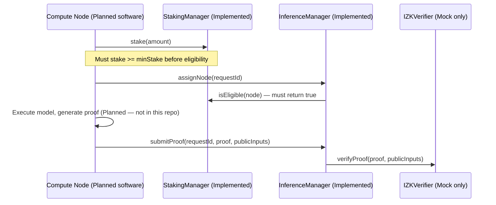

# Compute Node Specification

**Status: Planned (node software), Implemented (on-chain interaction points).** No Compute Node client exists in this repository. What exists is the on-chain contract surface a Compute Node would call against — that surface is real, tested, and is the authoritative interface for any future implementation.

## 1. Role (Whitepaper §2.1)

Compute Nodes are hardware operators providing GPU/TPU resources to execute AI models and generate the corresponding zero-knowledge proofs. This repository does not contain any GPU/TPU execution code, model-serving code, or proof-generation code — those remain **Planned**.

## 2. On-Chain Interface (Implemented)

A Compute Node interacts with exactly one contract, `InferenceManager`, through three functions:

| Function | Contract | Status | Preconditions |
|---|---|---|---|
| `stake(uint256 amount)` | `StakingManager` | Implemented | `amount > 0`, node not jailed |
| `assignNode(bytes32 requestId)` | `InferenceManager` | Implemented | Request in `REQUEST_SUBMITTED` state; caller passes `isEligible()` |
| `submitProof(bytes32 requestId, bytes proof, bytes publicInputs)` | `InferenceManager` | Implemented (contract side); **the proof itself cannot be honestly generated by anything in this repo** | Caller must be the assigned node; request in `PROCESSING` state |

## 3. Off-Chain Responsibilities (Planned, Not in This Repo)

| Responsibility | Status |
|---|---|
| Model weight storage and serving | Planned |
| Forward-pass execution | Planned |
| Halo2/Plonky3 circuit witness generation | Planned |
| ZK proof generation | Planned |
| Activation embedding extraction (for Attribution Node handoff) | Planned |
| P2P/mempool work-queue client (whitepaper §2.2 "Mempool / Work Queue") | Planned |

## 4. Economic Parameters

| Parameter | Where enforced | Value |
|---|---|---|
| Minimum stake to be eligible | `StakingManager` constructor (`minStake`) | Deploy-time configurable; `test/VeriMind.test.js` uses 1,000 VMIND as an illustrative value, not a protocol-mandated figure |
| Unstake cooldown | `StakingManager` constructor (`unstakeCooldown`) | Deploy-time configurable; test suite uses 7 days |
| Slash on invalid proof | Hard-coded in `InferenceManager.submitProof` | 10,000 bps = 100% of staked collateral |

## 5. Explicit Non-Claims

This document does not claim any Compute Node software exists, has been tested, or has ever generated a real proof. It documents only the on-chain contract surface such software would need to call, which is real and covered by tests.
