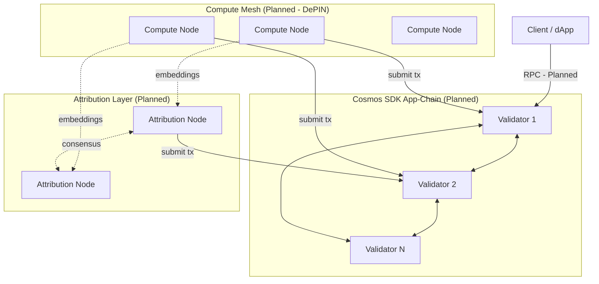
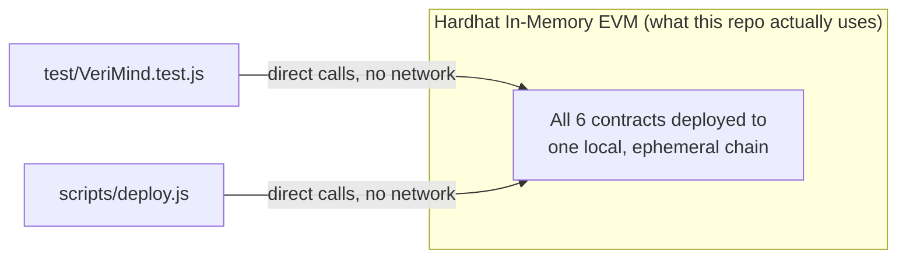

# Network Overview

**Status: Planned.** No P2P network, chain, or node discovery mechanism exists in this repository. This document gives a specification-level overview of the target network topology (whitepaper §2.1, §3) and states plainly what currently substitutes for it in testing.

## 1. Target Topology (Planned)

None of the network edges above exist as running infrastructure. This diagram is a specification target, not a description of deployed infrastructure.

## 2. What Substitutes for This Today: The Hardhat In-Memory EVM

Everything in this repository (`test/VeriMind.test.js`, `scripts/deploy.js`) runs against Hardhat's single-process, in-memory EVM — there is no network at all in the testing environment:

This is standard practice for smart contract development and testing — it is not a shortcoming to flag as a bug, but it is worth being explicit that **zero** of the distributed-systems properties described in §1 (multi-validator consensus, node discovery, P2P gossip) are exercised by anything in this repository's test suite.

## 3. Network-Level Components and Status

| Component | Status |
|---|---|
| Cosmos SDK app-chain | Planned |
| CometBFT P2P layer / gossip | Planned |
| Validator peer discovery | Planned |
| Compute Node mesh (DePIN) networking | Planned |
| Attribution Node peer-to-peer consensus | Planned |
| Public testnet | Planned — not started |
| Public mainnet | Planned — not started |
| Local development network (Hardhat) | **Implemented** — this is what `test/` and `scripts/deploy.js` actually run against |

## 4. Explicit Non-Claims

This repository does not contain, and this document does not claim the existence of: any testnet, any mainnet, any multi-node deployment, any P2P networking code, or any chain outside of Hardhat's ephemeral local EVM instance used for testing. Any reference elsewhere in this documentation set to "the chain" in a future-tense or planned context refers to the Cosmos SDK app-chain described in the whitepaper, which has not been built.
