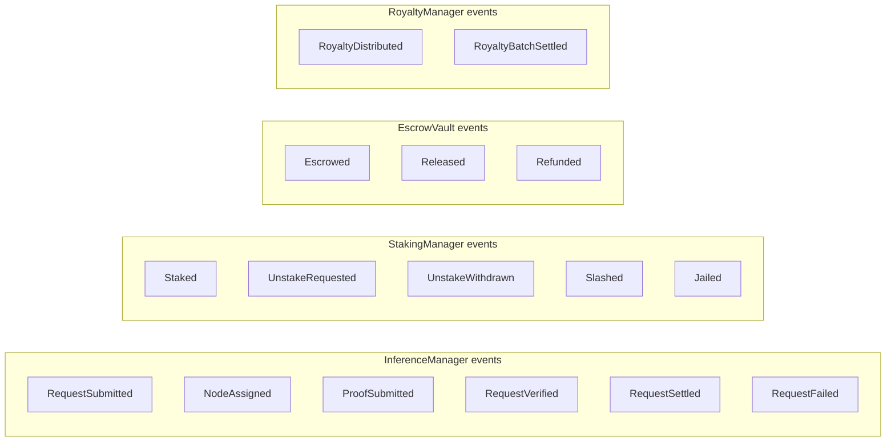

# Protocol Messages

**Status: Implemented (on-chain events and function signatures), Planned (any off-chain wire protocol / P2P messages).**

## 1. Scope

This document is the authoritative list of every message-like structure that actually exists in this repository's code — Solidity function calls and emitted events — separated from off-chain message formats implied by the whitepaper that have no implementation here.

## 2. On-Chain Messages (Implemented)

These are Solidity function signatures, i.e., the actual "messages" a real deployment processes today.

| Message | Contract | Direction |
|---|---|---|
| `submitRequest(bytes32, uint256, bytes32)` | `InferenceManager` | Client → Contract |
| `assignNode(bytes32)` | `InferenceManager` | Compute Node → Contract |
| `submitProof(bytes32, bytes, bytes)` | `InferenceManager` | Compute Node → Contract |
| `settle(bytes32, uint256)` | `InferenceManager` | Any address → Contract |
| `failOnTimeout(bytes32)` | `InferenceManager` | Any address → Contract |
| `stake(uint256)` / `requestUnstake(uint256)` / `withdrawUnstaked()` | `StakingManager` | Node → Contract |
| `distributeRoyalties(bytes32, uint256, address[], uint256[])` | `RoyaltyManager` | Settler → Contract |
| `propose(address, bytes)` / `vote(uint256)` / `execute(uint256)` | `Governance` | Voter → Contract |

## 3. Emitted Events (Implemented — the system's actual audit/notification layer)

Full field-level definitions are in the Solidity source (`contracts/*.sol`) — this document does not duplicate them to avoid drift; see each contract's `event` declarations directly.

## 4. Off-Chain Messages (Planned, Whitepaper-Implied, Not Implemented)

The whitepaper's lifecycle diagram (§2.2) implies several off-chain message types that have no schema, serialization format, or transport defined anywhere — including in this repository:

| Implied message | Between | Status |
|---|---|---|
| Prompt payload delivery | Client → Compute Node | Planned — only the `bytes32 promptHash` commitment is on-chain; the raw prompt transport is unspecified |
| Work unit / weight fetch | Compute Node → Mempool/Work Queue | Planned — no work queue exists |
| Activation embedding delivery | Compute Node → Attribution Node | Planned — no schema defined |
| Multi-node retrieval consensus messages | Attribution Node ↔ Attribution Node | Planned — whitepaper §8 requires this but does not specify a message format |

## 5. Explicit Non-Claims

This document does not claim any P2P networking layer, message queue, or off-chain transport exists. Every "Implemented" item above is verifiable by reading the corresponding Solidity source file directly.
