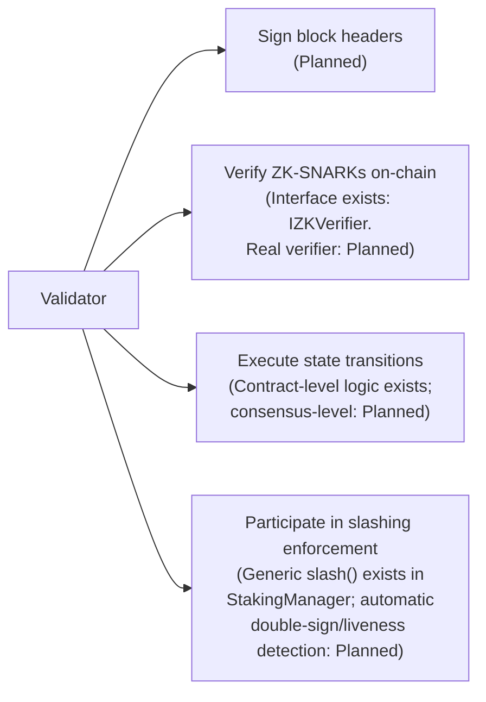

# Validator Specification

**Status: Planned.** No validator node software exists in this repository. This is a specification for future implementation, cross-referenced against the one piece of validator-adjacent logic that *is* built: `contracts/StakingManager.sol`.

## 1. Relationship to This Repo

See [`../architecture/validator-lifecycle.md`](../architecture/validator-lifecycle.md) for the full lifecycle discussion. This document focuses narrowly on the **specification** a validator implementation would need to satisfy — hardware, software, and protocol-level requirements — none of which have been built yet.

## 2. Minimum Requirements (Specification Target)

| Requirement | Value | Status |
|---|---|---|
| Consensus client | CometBFT (via Cosmos SDK) | Not implemented |
| Minimum stake | Not yet fixed by any document — whitepaper does not specify a numeric validator minimum (distinct from `StakingManager`'s configurable `minStake` for Compute/Attribution nodes, which is a deploy-time constructor parameter, not a validator threshold) | Undefined — open item |
| Uptime target | Implied by liveness slashing (500/10,000 missed block signatures tolerated, §3.2) | Not implemented |
| Hardware | Not specified in the whitepaper | Undefined — open item |

## 3. Responsibilities

## 4. Registration Flow (Specification, Not Implemented)

No contract in this repository implements validator registration. A specification-level sketch, consistent with `StakingManager`'s existing patterns (stake → eligibility check → jail/slash), would be:

1. Operator stakes ≥ minimum validator stake (threshold TBD)
2. Operator's consensus key is registered with the chain (mechanism TBD — depends on the eventual Cosmos SDK module chosen)
3. Operator is included in the active validator set (selection rule — e.g., top-N by stake — TBD)
4. Operator signs blocks; liveness and safety are monitored by the consensus layer itself, not by any contract

This flow is **not implemented** anywhere in this repository. It is included here only so that future validator-module work has a documented starting point consistent with the existing `StakingManager` design vocabulary (stake, jail, slash).

## 5. Explicit Non-Claims

This specification does not claim:
- Any running validator, testnet, or mainnet
- Any consensus client integration
- Any numeric minimum stake for validators (as opposed to Compute/Attribution nodes, which do have a configurable `minStake` in `StakingManager.sol`)
- Any specific validator set size or selection algorithm

These remain open design questions for the Cosmos SDK app-chain phase described in `docs/ROADMAP.md`.
