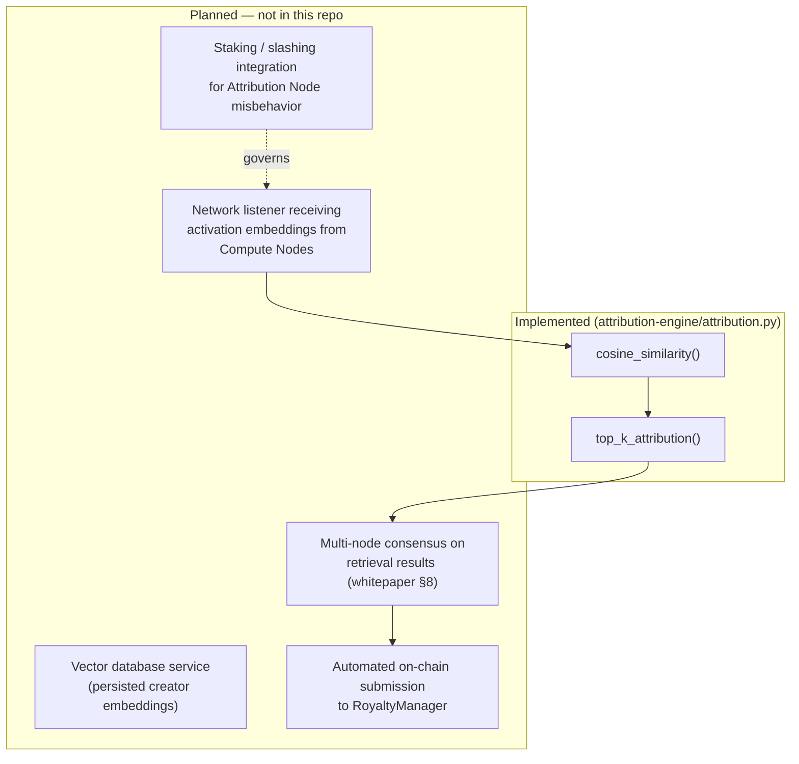

# Attribution Node Specification

**Status: Prototype (scoring algorithm), Planned (networked node software).**

## 1. Role (Whitepaper §2.1)

Attribution Nodes manage high-dimensional vector databases, compute cosine similarity matrices, and derive fractional attribution scores for dataset creators. This repository implements the **scoring algorithm** these nodes would run, as a standalone reference module — it does not implement a running, networked, staked node.

## 2. What Exists: `attribution-engine/attribution.py`

| Function | Purpose | Status |
|---|---|---|
| `cosine_similarity(x, d)` | Sim(x, d_i) per whitepaper §5.1 | Implemented, tested |
| `top_k_attribution(query, creators, k, tau)` | Full top-K + softmax scoring pipeline | Implemented, tested |

This module takes a Python list of `Creator(address, embedding)` objects in memory and returns basis-point scores ready for `RoyaltyManager.distributeRoyalties()`. It does not fetch embeddings from anywhere, does not persist a vector database, and does not run as a service.

## 3. What Is Planned (Not in This Repo)



| Component | Status |
|---|---|
| Persisted, queryable vector database | Planned |
| Network service receiving embeddings from Compute Nodes | Planned |
| Multi-node consensus on top-K retrieval (mitigation for the manipulation scenario in `../security/attack-scenarios.md`) | Planned |
| Staking/slashing specifically for Attribution Nodes (distinct from `RoyaltyManager.SETTLER_ROLE`, which is currently a simple trusted role — see `../architecture/contract-interactions.md` §2) | Planned |
| Automated, permissionless submission to `RoyaltyManager.distributeRoyalties` | Planned — currently a manual/trusted call, see `../architecture/protocol-flow.md` §3 |

## 4. Interface Contract Between Attribution Logic and On-Chain Settlement

The one place this repo defines a firm contract between "what the scoring math produces" and "what the chain accepts" is the basis-point sum invariant:

```python
# attribution-engine/attribution.py
bps = [round(s * 10_000) for s in softmax_scores]
drift = 10_000 - sum(bps)
if bps:
    bps[0] += drift
```

```solidity
// contracts/RoyaltyManager.sol
require(sumBps == 10_000, "scores must sum to 10000 bps");
```

Any future Attribution Node implementation, in any language, must preserve this invariant (scores summing to exactly 10,000 basis points) to interoperate with `RoyaltyManager` without reverting.

## 5. Explicit Non-Claims

No claim is made that Attribution Nodes exist as a running network, that any consensus mechanism governs their output today, or that royalty distributions in this repo's tests reflect anything beyond manually-supplied test fixtures.
