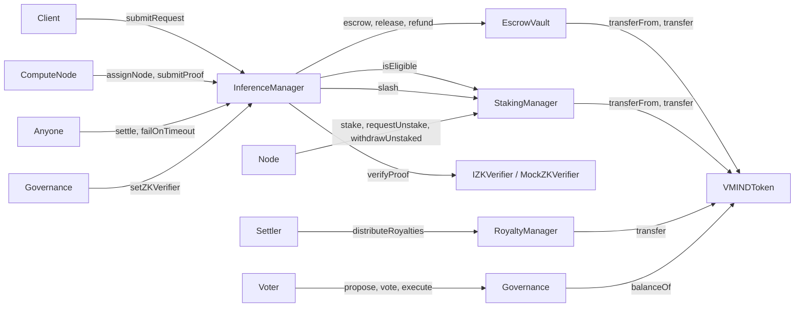

# Contract Interactions

**Status: Implemented.** This describes the actual call graph and access-control wiring between the six contracts in `contracts/`, as deployed by `scripts/deploy.js`.

## 1. Call Graph

## 2. Access Control Matrix

Every privileged function is gated by OpenZeppelin `AccessControl` roles. This table is the ground truth for who can call what — it should match the `onlyRole` modifiers in the Solidity source exactly.

| Contract | Role | Granted to (per `scripts/deploy.js`) | Gated functions |
|---|---|---|---|
| `EscrowVault` | `CONTROLLER_ROLE` | `InferenceManager` | `escrow`, `release`, `refund` |
| `StakingManager` | `SLASHER_ROLE` | `InferenceManager` (deployer also self-grants at construction) | `slash`, `jail` |
| `RoyaltyManager` | `SETTLER_ROLE` | Not granted by default in `deploy.js` — must be granted manually (see limitation below) | `distributeRoyalties` |
| `InferenceManager` | `DEFAULT_ADMIN_ROLE` | Deployer | `setZKVerifier` |
| `StakingManager` | `DEFAULT_ADMIN_ROLE` | Deployer | Role management only (no other gated function currently uses it directly) |

**Limitation:** `deploy.js` does not grant `RoyaltyManager.SETTLER_ROLE` to any address — the test suite grants it explicitly to the deployer for testing purposes (`test/VeriMind.test.js`). A production deployment must decide who (or what automated Attribution Node process) should hold this role, since it is currently a manual step.

## 3. Token Flow Summary

`VMINDToken` is the only asset that moves between contracts. Three independent pools of VMIND exist inside the system at any time:

1. **Escrowed client fees** — held by `EscrowVault`, released to a Compute Node on settlement or refunded to the client on failure.
2. **Staked collateral** — held by `StakingManager`, at risk of `slash()`, returned to the node after `requestUnstake()` + cooldown via `withdrawUnstaked()`.
3. **Royalty pools** — expected to be transferred into `RoyaltyManager` prior to calling `distributeRoyalties()`; the contract does not pull funds itself, the caller must fund it first (see `RoyaltyManager.sol` — no `transferFrom` call exists in `distributeRoyalties`, only `transfer` out).

This last point is a **deliberate simplification** worth flagging: in the current implementation, whoever calls `distributeRoyalties` is responsible for ensuring `RoyaltyManager`'s balance already covers `totalAmount`. There is no on-chain enforcement linking a specific `InferenceManager.settle()` call to a specific royalty pool funding transaction. A production version should likely have `InferenceManager` release escrowed royalty funds directly into `RoyaltyManager` as part of `settle()`, rather than treating them as separate manual steps.

## 4. External Dependencies

| Dependency | Used by | Purpose |
|---|---|---|
| `@openzeppelin/contracts` (`AccessControl`, `ReentrancyGuard`, `IERC20`) | All contracts except `Governance`'s voting logic | Role-based access control and reentrancy protection |

No other external contracts or oracles are called. There is no price oracle, no cross-chain messaging, and no upgradeability proxy pattern in this PoC — all contracts are deployed as immutable, non-upgradeable bytecode.
