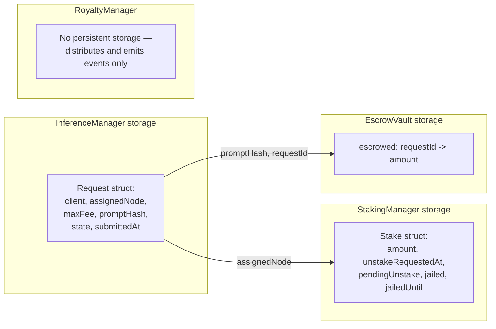

# Data Flow

**Status: Mixed** — on-chain data flow is **Implemented**; off-chain data flow (embeddings, model weights, proofs generation) is **Planned**, described here only as a specification target.

## 1. Purpose

This document separates what data actually exists and moves through the system today (contract storage and events) from what the whitepaper specifies but is not yet built, so that anyone reading the codebase knows exactly which claims are verifiable by running the tests versus which are architectural intent.

## 2. On-Chain Data (Implemented)

None of these structs store the actual prompt text, model weights, or output content — only a `bytes32 promptHash` commitment. This matches whitepaper §10's example payload (`prompt_hash` field), which implies the raw prompt is transmitted off-chain (e.g., directly to the assigned Compute Node) and only its hash is anchored on-chain for integrity/replay protection.

## 3. Off-Chain Data (Planned / Reference Only)

| Data | Where it would flow | Status |
|---|---|---|
| Raw prompt text | Client → Compute Node, off-chain | **Planned** — no transport layer exists in this repo |
| Model weights | Compute Node local storage or DePIN mesh | **Planned** |
| Activation embeddings | Compute Node → Attribution Node | **Planned** — no embedding extraction or transport code exists |
| ZK proof bytes | Compute Node → `InferenceManager.submitProof` | **Partially implemented**: the contract accepts arbitrary `bytes calldata proof`; nothing in this repo *generates* a real proof |
| Attribution score vector | Attribution Node → `RoyaltyManager.distributeRoyalties` | **Implemented as reference math** (`attribution-engine/attribution.py`) computing the correct values; **not implemented** as an automated on-chain submission from a running node |

## 4. Event Log as the Audit Trail

Since none of the contracts store historical records beyond current state, the emitted events are the source of truth for reconstructing request history:

| Contract | Key events |
|---|---|
| `InferenceManager` | `RequestSubmitted`, `NodeAssigned`, `ProofSubmitted`, `RequestVerified`, `RequestSettled`, `RequestFailed` |
| `StakingManager` | `Staked`, `UnstakeRequested`, `UnstakeWithdrawn`, `Slashed`, `Jailed` |
| `EscrowVault` | `Escrowed`, `Released`, `Refunded` |
| `RoyaltyManager` | `RoyaltyDistributed`, `RoyaltyBatchSettled` |
| `Governance` | `ProposalCreated`, `Voted`, `ProposalExecuted` |

A production indexer (e.g. a subgraph) consuming these events would give the Attribution Node / off-chain services enough information to reconstruct full request state without needing additional on-chain storage — this is a reasonable default Ethereum/Cosmos indexing pattern, not something specific that has been built here.

## 5. Data Not Modeled At All

The following whitepaper concepts have no data representation anywhere in this repo yet, on-chain or off-chain:

- Vector database contents / indexed creator embeddings (§2.1, §5)
- DePIN compute-mesh hardware attestation data
- Cross-node consensus messages for top-K retrieval agreement (§8)

These are flagged here rather than silently omitted so the gap is explicit for planning purposes.
