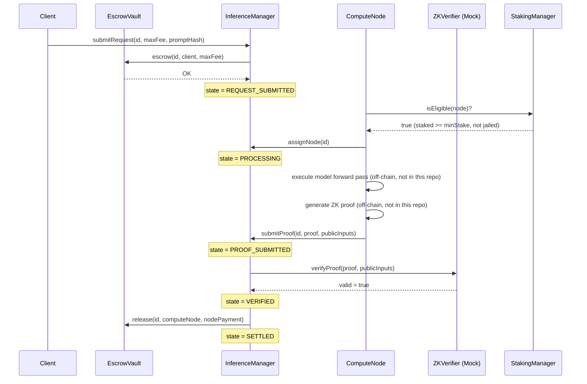
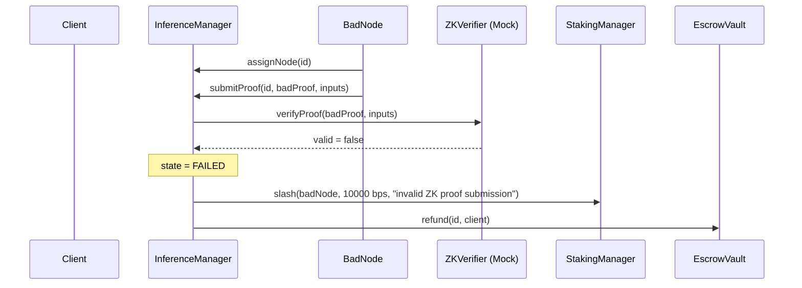
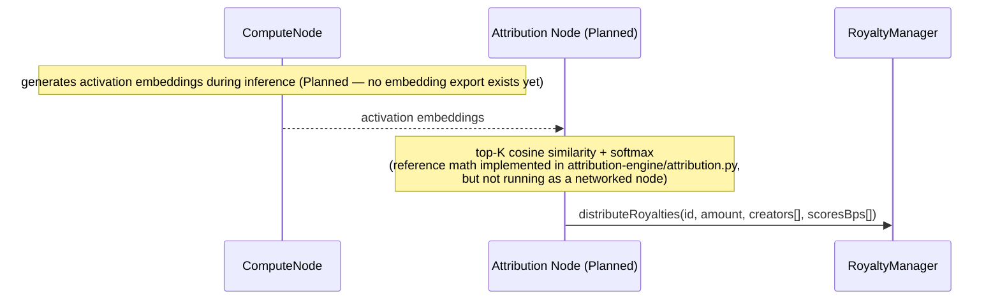

# Protocol Flow

**Status: Implemented (on-chain state machine), Prototype (off-chain actors)**

This document traces one inference request end-to-end through the contracts in this repository, corresponding to whitepaper §2.2. Every step below is exercised by an automated test in `test/VeriMind.test.js`.

## 1. Sequence Diagram — Happy Path

## 2. Sequence Diagram — Invalid Proof (Adversarial Path)

## 3. Off-Chain Steps Not Yet Implemented

The attribution and royalty step (whitepaper §2.2, §5) sits between proof verification and final settlement:

**Implemented:** the scoring math (`attribution-engine/attribution.py`) and the on-chain settlement (`RoyaltyManager.distributeRoyalties`).
**Not implemented:** the networked Attribution Node that would compute embeddings, run consensus with peer Attribution Nodes on the retrieval result (whitepaper §8, "Oracle & Vector Manipulation"), and submit the transaction automatically. In this repo, `distributeRoyalties` must currently be called by an address holding `SETTLER_ROLE` — there is no automated trigger wiring it to `InferenceManager` settlement yet.

## 4. Step-by-Step Reference

| # | Actor | Action | Contract call | State before → after |
|---|---|---|---|---|
| 1 | Client | Submit prompt, escrow max fee | `InferenceManager.submitRequest` | `IDLE` → `REQUEST_SUBMITTED` |
| 2 | Compute Node | Claim the work unit | `InferenceManager.assignNode` | `REQUEST_SUBMITTED` → `PROCESSING` |
| 3 | Compute Node | Execute model (off-chain, not in repo) | — | — |
| 4 | Compute Node | Generate ZK proof (off-chain, not in repo) | — | — |
| 5 | Compute Node | Submit proof | `InferenceManager.submitProof` | `PROCESSING` → `PROOF_SUBMITTED` → `VERIFIED` or `FAILED` |
| 6 | Attribution Node (planned) | Compute royalty scores | *off-chain, reference math only* | — |
| 7 | Settler | Distribute royalties | `RoyaltyManager.distributeRoyalties` | — |
| 8 | Anyone | Settle node payment | `InferenceManager.settle` | `VERIFIED` → `SETTLED` |
| — | Anyone | Trigger timeout if stuck | `InferenceManager.failOnTimeout` | `REQUEST_SUBMITTED`/`PROCESSING` → `FAILED` |

See [`state-machine.md`](./state-machine.md) for the full state diagram including all transitions and guards.
