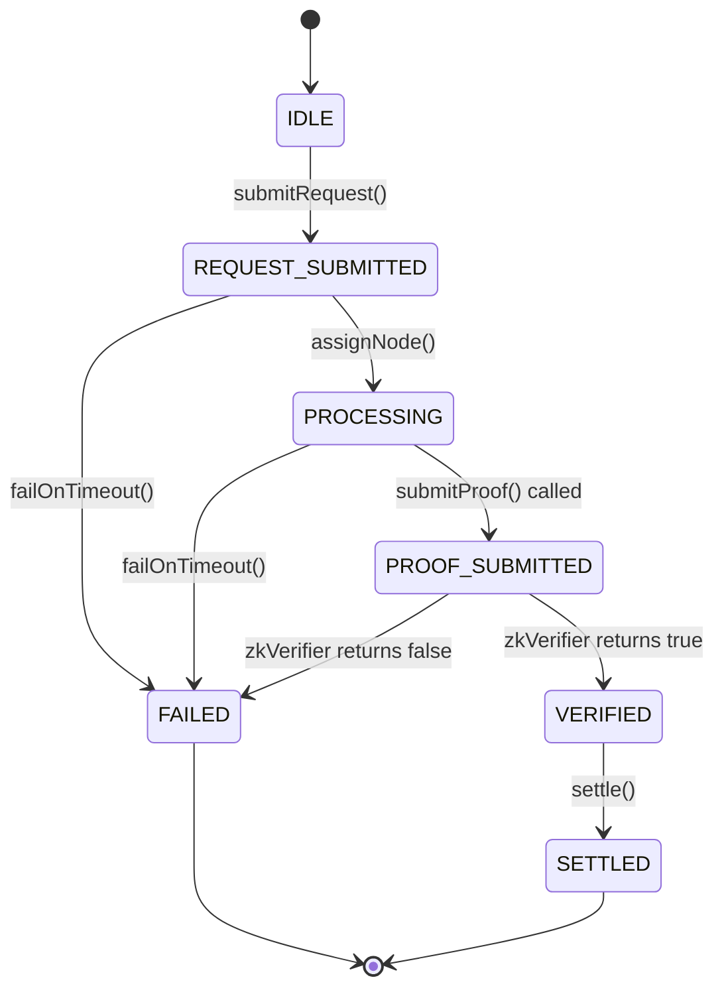

# InferenceManager State Machine

**Status: Implemented.** This document describes `contracts/InferenceManager.sol` exactly as written — every transition below has a corresponding `require` guard in the contract and a test case in `test/VeriMind.test.js`.

## 1. State Diagram

Note: `PROOF_SUBMITTED` is a transient state within a single transaction — `submitProof()` sets it and then immediately calls the verifier and moves to `VERIFIED` or `FAILED` in the same call. It is observable only if the verifier call somehow does not resolve synchronously (not possible with the current `IZKVerifier` interface, which is a plain `view` call) — it is included because it is explicitly named in whitepaper §7 and reserved here for forward compatibility with a verifier design that might require multiple steps.

## 2. Transition Table

| From | To | Trigger function | Guard conditions | Side effects |
|---|---|---|---|---|
| `IDLE` | `REQUEST_SUBMITTED` | `submitRequest(id, maxFee, promptHash)` | Request `id` must not already exist | `EscrowVault.escrow()` pulls `maxFee` from client |
| `REQUEST_SUBMITTED` | `PROCESSING` | `assignNode(id)` | Caller must pass `StakingManager.isEligible()` | Assigns `msg.sender` as the request's node |
| `REQUEST_SUBMITTED` / `PROCESSING` | `FAILED` | `failOnTimeout(id)` | `block.timestamp >= submittedAt + processingTimeout` | `EscrowVault.refund()` returns funds to client |
| `PROCESSING` | `VERIFIED` | `submitProof(id, proof, publicInputs)` | Caller must be the assigned node; `zkVerifier.verifyProof()` returns `true` | — |
| `PROCESSING` | `FAILED` | `submitProof(id, proof, publicInputs)` | Caller must be the assigned node; `zkVerifier.verifyProof()` returns `false` | `StakingManager.slash(node, 10000, ...)` (100% of collateral) + `EscrowVault.refund()` |
| `VERIFIED` | `SETTLED` | `settle(id, nodePayment)` | `nodePayment <= maxFee` | `EscrowVault.release()` pays the compute node |

## 3. Fields Not (Yet) in the Whitepaper's Diagram

The implementation adds `processingTimeout`-based liveness handling that the whitepaper's ASCII state diagram (§7) shows only as a generic `STATE_FAILED (Timeout / Slashing)` branch without specifying the trigger mechanism. `failOnTimeout()` is this repository's concrete interpretation: **any address** may call it once the timeout has elapsed, avoiding a liveness dependency on a single privileged actor.

## 4. Known Limitations

- There is no partial-failure or dispute-resolution path (e.g., a client disputing a settled payment). Once `SETTLED` or `FAILED`, a request is terminal.
- `settle()` is currently permissionless (callable by any address, not just the client or node) provided the request is `VERIFIED`. This is intentional for the PoC to keep the happy path simple, but should be reviewed before production — see [`../security/threat-model.md`](../security/threat-model.md#settlement-griefing).
- Royalty distribution (`RoyaltyManager.distributeRoyalties`) is **not** wired into this state machine automatically; it must be triggered separately by a `SETTLER_ROLE` holder. See [`protocol-flow.md`](./protocol-flow.md#3-off-chain-steps-not-yet-implemented).
