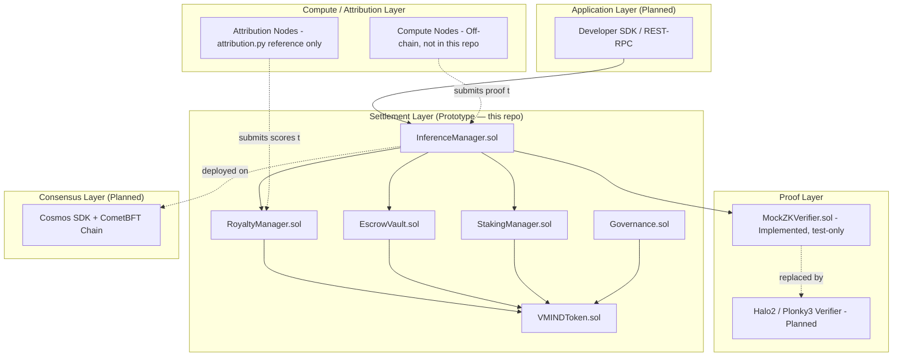

# System Architecture

**Status: Prototype** — the components below are implemented as a single-chain PoC (Solidity contracts on an EVM-compatible chain). The multi-layer Cosmos SDK + EVM execution architecture described in the whitepaper is the target production topology and is **Planned**.

## 1. Overview

VeriMind Protocol coordinates five actor classes (whitepaper §2.1) around one core workflow: a client submits an inference request, a Compute Node executes it and proves correctness with a zero-knowledge proof, an Attribution Node determines which data creators the output draws from, and Validators settle payment and royalties on-chain.

This document describes how that workflow maps onto the actual repository components today, and what remains to reach the full architecture in the whitepaper.

## 2. Layered View

## 3. Component Inventory

| Component | Status | Location |
|---|---|---|
| VMINDToken (ERC-20, fixed supply, allocation split) | **Implemented** | `contracts/VMINDToken.sol` |
| StakingManager (collateral, cooldown, slashing, jailing) | **Implemented** | `contracts/StakingManager.sol` |
| EscrowVault (fee holding, release, refund) | **Implemented** | `contracts/EscrowVault.sol` |
| InferenceManager (request lifecycle state machine) | **Implemented** | `contracts/InferenceManager.sol` |
| RoyaltyManager (basis-point payout distribution) | **Implemented** | `contracts/RoyaltyManager.sol` |
| Governance (token-weighted proposal voting) | **Implemented, minimal** | `contracts/Governance.sol` |
| Attribution scoring (cosine similarity + softmax) | **Implemented as reference**, not a running node | `attribution-engine/attribution.py` |
| ZK proof verification (Halo2/Plonky3) | **Not implemented** — interface only, mock stand-in | `contracts/interfaces/IZKVerifier.sol`, `contracts/mocks/MockZKVerifier.sol` |
| Cosmos SDK consensus chain | **Planned** | — |
| Compute Node client software | **Planned** | — |
| Attribution Node client software (networked, indexed) | **Planned** | — |
| Developer SDK / REST-RPC server | **Planned** (spec only, whitepaper §10) | — |

## 4. Why EVM-only today

The whitepaper's target chain architecture is Cosmos SDK with EVM execution (a app-chain with an EVM-compatible execution environment, e.g. via an EVM module). Building and operating a full app-chain is a substantially larger engineering and infrastructure effort than validating the contract-level economic logic. This repository intentionally scopes down to **the settlement-layer contracts running on any single EVM chain** (tested against Hardhat's in-memory EVM) so that the core mechanics — escrow, staking/slashing, attribution-weighted payout — can be verified in isolation before committing to app-chain infrastructure.

This is a deliberate sequencing decision, not a deviation from the design: see `docs/ROADMAP.md` for the path from this prototype to the full Cosmos SDK deployment.

## 5. Trust Boundary Summary

A full breakdown of assumptions and adversarial cases lives in `docs/security/threat-model.md`. At the architecture level, the boundary that matters most is:

- **Inside the trust boundary today:** all Solidity contracts in `contracts/` — their behavior is enforced by EVM execution and covered by `test/VeriMind.test.js`.
- **Outside the trust boundary today:** the correctness of any ZK proof, since `MockZKVerifier.sol` accepts any non-empty proof by design. No claim of cryptographic soundness should be inferred from this repository until the real verifier lands.

## 6. Related Documents

- [`protocol-flow.md`](./protocol-flow.md) — end-to-end request lifecycle sequence diagram
- [`state-machine.md`](./state-machine.md) — `InferenceManager` state transitions in detail
- [`contract-interactions.md`](./contract-interactions.md) — call graph between contracts
- [`data-flow.md`](./data-flow.md) — what data moves where, on-chain vs. off-chain
- [`validator-lifecycle.md`](./validator-lifecycle.md) — validator responsibilities, current and planned
