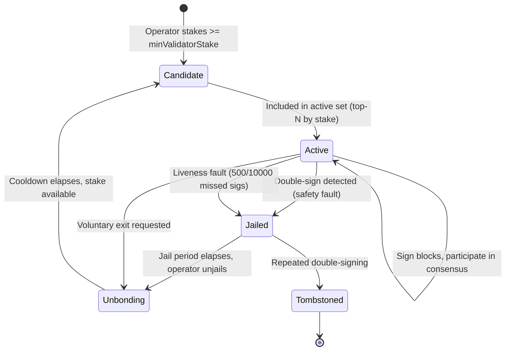

# Validator Lifecycle

**Status: Planned.** No validator set, consensus client, or CometBFT integration exists in this repository. This document specifies the intended lifecycle so implementation work has a fixed target, consistent with whitepaper §3.

## 1. Why Validators Are Not Yet in This Repo

The current PoC runs as a set of Solidity contracts on a single EVM execution environment (see [`system-architecture.md`](./system-architecture.md)). "Validators" in the full whitepaper design are CometBFT consensus participants of a dedicated Cosmos SDK app-chain — a different piece of infrastructure than smart contracts, requiring node software, P2P networking, and chain governance that has not been built yet.

What **is** implemented today is the piece of validator responsibility that maps cleanly onto a smart contract: staking, slashing, and jailing accounting, in `contracts/StakingManager.sol`. That contract is written to be actor-agnostic — the same staking/slashing primitives apply whether the caller is a Compute Node, an Attribution Node, or (once built) a consensus Validator.

## 2. Intended Lifecycle (Planned)

## 3. Responsibilities (Whitepaper §2.1, §3)

| Responsibility | Status |
|---|---|
| Validate consensus block headers | Planned — requires CometBFT integration |
| Verify submitted ZK-SNARKs on-chain | **Partially implemented as a contract call** (`InferenceManager.submitProof` → `IZKVerifier.verifyProof`), but the verifier itself is a test-only mock, and there is no consensus-level requirement that validators independently re-verify |
| Execute state transition functions | Implemented at the contract level (`InferenceManager`'s state machine); not yet at the consensus/app-chain level |
| Enforce slashing conditions | **Implemented** in `StakingManager.slash` / `StakingManager.jail`, callable today only by addresses holding `SLASHER_ROLE` (granted to `InferenceManager` in this PoC) |

## 4. Slashing Parameters

Values below match whitepaper §3.2 and are the constants a production `Governance`-controlled validator module should target. The current `StakingManager` contract implements a generic `slash(address, bps, reason)` function — it does not yet hard-code these specific triggers, since there is no consensus layer to detect double-signing or liveness faults from.

| Condition | Penalty | Additional effect |
|---|---|---|
| Double signing | 5% of staked $VMIND | Jailed 30 days |
| Liveness fault (500/10,000 missed blocks) | 0.01% of staked $VMIND | — |
| Invalid ZK proof submission (Compute Node, not a consensus Validator) | 100% of collateral for that node | **Implemented** exactly as specified — see `InferenceManager.submitProof` |

## 5. Gap to Production

1. Select and integrate a CometBFT-based consensus client (or equivalent) as the Cosmos SDK app-chain base.
2. Implement a native validator module (likely `x/staking`-derived) enforcing the double-signing and liveness slashing conditions automatically, rather than via a generic externally-triggered `slash()` call.
3. Wire the `IZKVerifier` interface to an actual on-chain precompile so proof verification happens as part of block execution, not a standalone contract call.
4. Define validator set size, rotation, and delegation mechanics — none of which are specified beyond the slashing table above in the current whitepaper.
