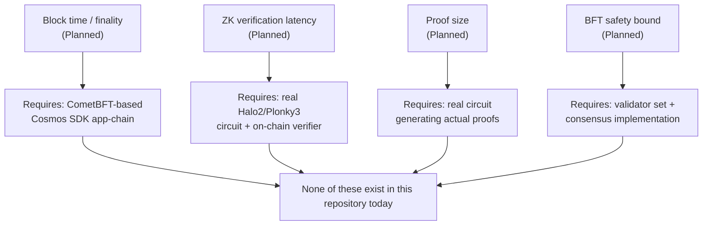

# Performance Targets

**Status: Planned (targets only) — no component in this repository has been benchmarked against these figures.** This document distinguishes whitepaper-stated targets from what would need to be built and measured to validate them, so the roadmap has concrete numbers to aim for rather than vague aspirations.

## 1. Whitepaper-Stated Targets

| Metric | Target | Whitepaper reference | Verified in this repo? |
|---|---|---|---|
| Block generation time | 1 second, instant finality | §3.1 | No — no consensus client exists |
| On-chain ZK proof verification latency | < 10 ms (EVM precompile) | §4.1 | No — `MockZKVerifier` has near-zero cost but performs no real verification, so this number is meaningless until a real verifier exists |
| Proof size | ~1.5 KB – 12 KB compressed | §4.1 | No — no real proof has ever been generated by any component in this repo |
| Byzantine fault tolerance | Safe while < 1/3 voting power is malicious ($3f+1 \le N$) | §3.1 | No — standard BFT bound, inherited from CometBFT if/when it is integrated; not something this repo's contracts implement or could violate on their own |

## 2. What Would Need to Exist to Measure Each Target

## 3. What This Repo Can Measure Today (Contract-Level Only)

The only performance-relevant numbers this repository can currently speak to are Solidity gas costs, covered separately in [`gas-analysis.md`](./gas-analysis.md) — and even those are order-of-magnitude estimates, not measurements, since the sandbox this documentation was produced in had no network access to install and run `hardhat-gas-reporter`.

| Layer | Measurable today? | Where |
|---|---|---|
| Smart contract gas cost | Estimated only, not measured | `gas-analysis.md` |
| Smart contract correctness / functional behavior | **Yes** — via `test/VeriMind.test.js` | Run `npx hardhat test` |
| Attribution scoring correctness | **Yes** — via `attribution-engine/test_attribution.py` | Run `pytest` |
| Attribution scoring throughput at scale | No — reference implementation only, see `attribution-engine.md` §3 | — |
| End-to-end request latency (client submit → settlement) | No — depends on off-chain Compute Node and consensus block time, neither of which exist | — |

## 4. Recommended Order of Measurement (Once Components Exist)

1. Attribution engine throughput at realistic creator-catalog scale, once an ANN index replaces the linear scan (see `attribution-engine.md` §3)
2. Real smart contract gas costs, once `npm install` can run against network access (see `gas-analysis.md` §3)
3. Real ZK proof generation time and size, once a circuit for at least one reference model exists
4. On-chain verification latency, once the real verifier is deployed to a testnet
5. Block time and finality, only once a Cosmos SDK app-chain with CometBFT is running

Each step is a prerequisite for the next — this repository is currently positioned before step 1 is complete at production scale (a reference implementation exists, but has not been benchmarked against realistic data volumes).
